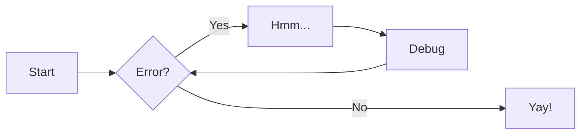
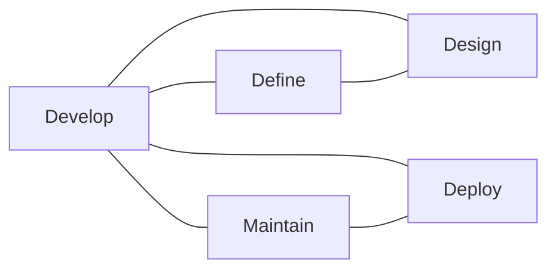

# Iterative Development Teams

!!! Abstract

    Iterative Development Team members work together delivering their work to other teams during the life time of the website.

!!! danger

    The slightest errors or security issues will require remediations sometime during the life time of the website.

---

<!-- :::

-->

## Development Teams

!!! note

    Data is bidirectional

    Iterative website development enables the *Define, Design, Develop, Deploy and Maintain* teams to be operational at the same time creating, testing and remediating website defects.

---

## Teams Prerequisites

### Define

The *Define* team prerequisites are: 
- Defining what the project is about
- Funding
- Purpose
- Functionality
- Stakeholders
- Content
- The *musts* and *wants* features
- The *security* requirements

### Design

The *Design* team prerequisites are:
- Decisions about Website Design
- Consistency
- Theme
- Color Scheme
- Typology
- Navigation
- User interaction.

### Develop

The *Develop* team prerequisites are: 
- Decisions about resources required to transform the *Define* and *Design* work into a website and infrastructure. 
- Decisions about using a static site generator and programming tools.

### Deploy

The Deploy team prerequisites are: 
- Decisions about resources required for deploying production version of the website to the Internet.
- Decisions about resources required for team developers working on features, fixes, or testing to deploy private [Preview](deploy#preview) Internet websites with their changes, without disturbing other developers work or the production version.  See [Preview Deployments](glossary#preview-deployments)

### Maintain

The *Maintain* team prerequisites are: 
- Decisions about remediating deployed websites *Define*, *Design*,*Develop*, *Deploy*, or *Security* defects.
- Organizing members from other teams to be part of the *Maintain* team while remediating specific defects.

---
