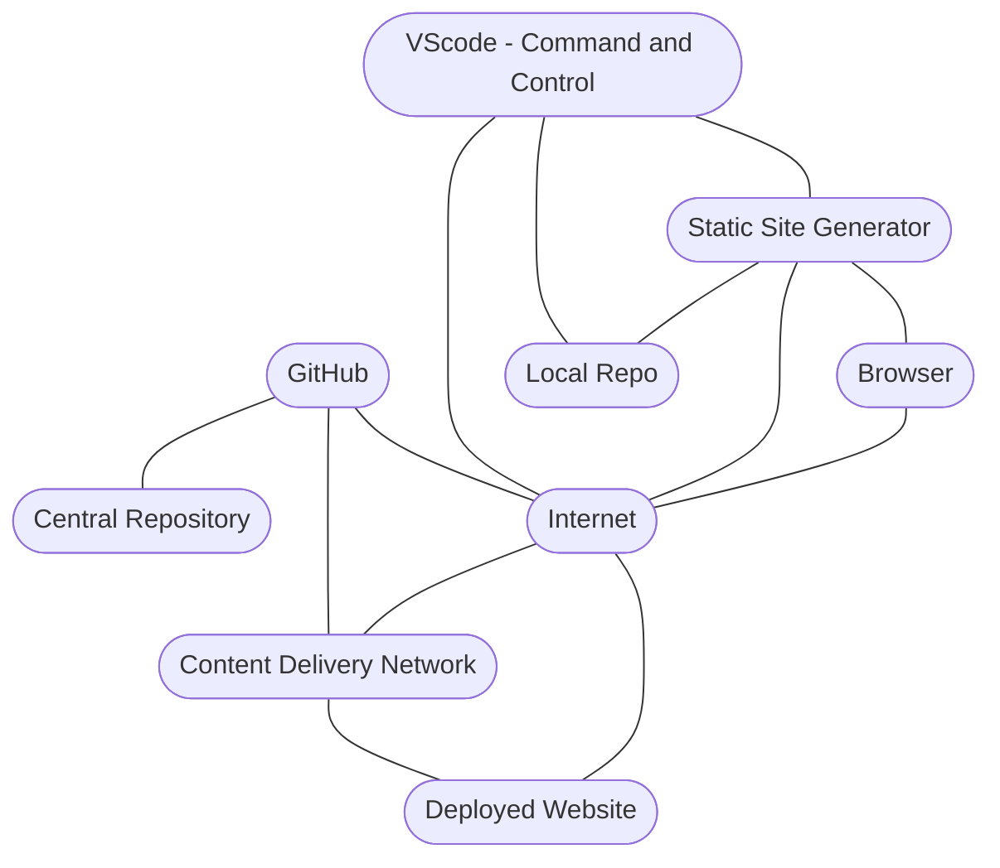

!!! Abstract 

	The *Iterative Website Development Stack* illustrates how websites are developed and deployed to the Internet. It is web browser agnostic. What works for big screens, works for small screens.

--
<!--

-->

### Website Development Stack

### Mermaid
---

!!! info

	The key *Iterative Development* technologies are  [GitHub](git-github#github), [git](git-github#git), and a [Content Delivery Network (CDN)](https://en.wikipedia.org/wiki/Content_delivery_network) like [Cloudflare](deploy/#cloudflare)

Team members use the Website Development Stack to develop and deploy websites to the Internet. 

There would be confusion and possible defects created if Team members were to directly make changes to the central project repository.  

A solution to this problem is to have one central repository controlled by a team member gatekeeper. Each team member [forks](git-github#fork) a copy of central project repository to their GetHub account and makes a [clone](glossary#clone) of it on their workstation.

---

- Each developer makes changes to their repository [clone](glossary#clone). They cannot directly make changes to the central repository.

	- Team members commit changes to their local repository clone

	- They may deploy their local repository to a private [Preview](deploy#preview) Internet website for stakeholders to see and give feedback. 

- The process is managed using [GitHub for Teams](https://github.com/team). When stakeholders determine developers changes, defect fixes, or new features are ready, a GitHub [Pull Request](git-github#pull-request) is made by developers to the central project repository. 

	- Project team members and the gatekeeper are notified by GitHub of the [Pull Request](git-github#pull-request) request. They may examine, comment on, suggest possible changes, and test the code. 

	- When the team agrees on committed developers changes, they are committed to the central project repository by the gatekeeper. This process is repeated for all developer committed changes. 

	- Iterations of the central project repository may be deployed by the gatekeeper to a private [Preview](deploy#preview)  for stakeholders viewing. 

- The next step is each developer [Pulls](git-github#pull) the central repository changes and commits them to their local repository copy of the central project. This process keeps team members up to date on changes.

- The central project repository may be deployed to the public Internet by the gatekeeper after stakeholders agree there have been sufficient development and testing iterations.

---

